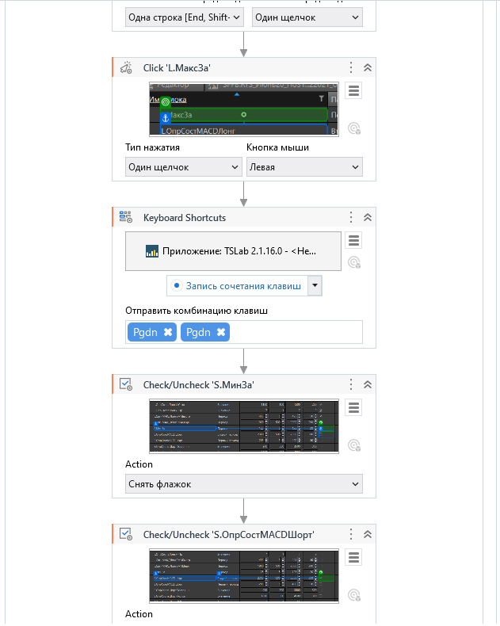
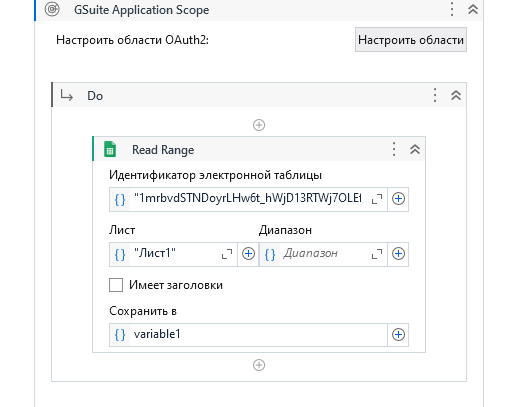
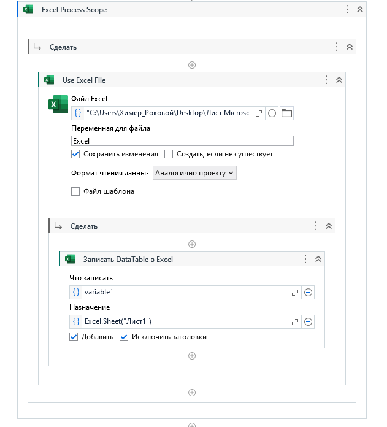

<h3>Описание</h3>

Скрипт на UIPath для расчета данных с TSLab и запись в google таблицу.

В папке <a href="./Задание">Задание</a> -> видеоописание о том, как работает скрипт.

В архиве <a href="./TSLab">TSLab</a> -> скрипт торгового бота и исторические данные.

В архиве <a href="./UIPath">UIPath</a> -> основной скрипт RPA.

В архиве <a href="./Пример">Пример</a> -> пример работы с таблицами, чтение и запись.

В папке <a href="./vid">vid</a> -> видеоописание работы скрипта.

pass:path

